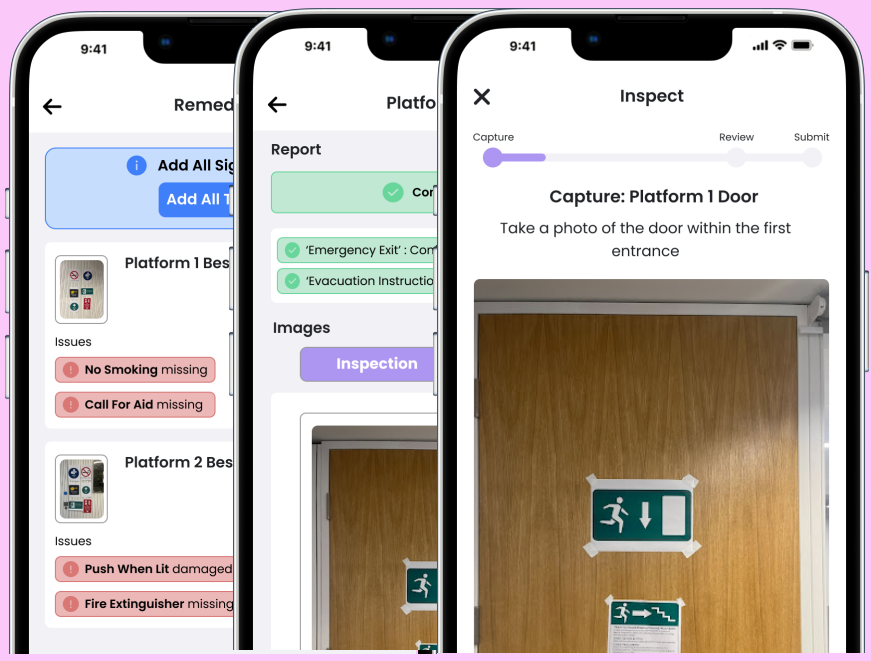

 &emsp;
 &emsp;
 &emsp;
 &emsp;
 &emsp;
 &emsp;

Table of Contents
=================

* [Detecting, Mapping and Verifying Signage with Computer Vision and Machine Learning](#detecting-mapping-and-verifying-signage-with-computer-vision-and-machine-learning)
   * [Motivation](#motivation)
   * [Achievements](#achievements)
      * [Comparative Evaluation](#comparative-evaluation)
   * [Documentation](#documentation)
      * [Group Report](#group-report)
      * [Presentation and Poster](#presentation-and-poster)

# Detecting, Mapping and Verifying Signage with Computer Vision and Machine Learning

## Motivation 

Currently, over 4500 train carriages are either in service or planned across the UK. The interior and exterior of each of these vehicles contain a large number of signs which address safety-critical, informational and accessibility aspects, and which must conform to manufacturer and regulatory standards. To adhere to these standards, the signs present in a vehicle must be inspected on a regular basis, with non-conformances (missing, damaged or incorrect positioning) documented and remedies scheduled for the next maintenance. 

If a vehicle leaves maintenance with a problem, penalties are incurred on the responsible parties (e.g., train manufacturer/operator), which vary depending on the severity of the issue, and grow rapidly should the issue persist.

At present, inspections and remediations are carried out and logged manually by trained personnel. There exists no system to ensure reliable inspection, documentation, purchasing and remediation of a train vehicle’s signs. The challenges presented by the current methods are experienced first-hand by **Stewart Signs** - a sign manufacturer, and this project’s client.

## Achievements

To address the inefficiencies regarding the current methods of manual train sign inspection, purchasing and remediation, this project sought to develop a proof-of-concept system that serves as a semi-automated improvement upon the existing approach.

Based on consultation with the client, the group designed and developed AutoSign - a system that supports the inspection of a train vehicle, the identification of missing and/or damaged signs, the purchasing of replacement signs, and the logging of remediations. In particular, AutoSign implements a three-component architecture, consisting of a mobile application to be
used by workers, a processing server that makes use of custom datasets and algorithms to process inspection footage, and a cloud server to host system data.

  

In testing, AutoSign’s application was shown to function according to its requirements, while its processing techniques were shown to be highly effective and accurate. When used in live trains and mock environments, AutoSign also demonstrated an ability to function as a single, cohesive system, and was able to correctly identify real-world non-conformances. These findings, and given the time available to develop AutoSign, demonstrate the feasibility of the approach in the commercial world and provide justification for its development beyond a proof-of-concept. 

Furthermore, AutoSign received positive feedback from potential users, who noted how such a system would improve their workflow and their preference for it over existing methods. This analysis is supported by the project’s comparative evaluation of AutoSign, which shows it to out-perform current approaches against a number of different criteria.

  

Based on this project’s findings, its final discussion presents a list of recommendations to the client regarding the transition of the proof-of-concept into a complete solution. This discussion aims to alleviate the constraints placed upon this project and address aspects outside of its reach. 

While the scope for future development is large, this project’s work remains significant for the client, and the rail industry. The conclusion of this project is the successful development of a proof-of-concept system that addresses a novel problem and demonstrates the capacity for a solution. This project has successfully shown that a system such as AutoSign is a feasible solution to the problems it first presented, and identified what is required to complete the transition from a proof-of-concept to a commercial product.

### Comparative Evaluation

The following list provides a comparative analysis of AutoSign with the existing approach, according to a number of criteria.

- **Inspection Time**: _Average time taken to perform an inspection._
  - The time taken to perform an inspection with AutoSign is quicker than a manual approach. This is because it takes less time to record a video/capture an image of a group of signs, in comparison to analyzing each sign independently.
- **Reliability**: _The precision and accuracy of the system for detecting non-conformances._
  - AutoSign provides more definitive and consistent precision and accuracy in comparison to manual methods. Manual methods, however, do provide more specificity with regard to non-conformance details.
- **Minimum Skill Required**: _The level of skill/knowledge required to complete the method._
  - A worker is able to perform an inspection using AutoSign without any prior knowledge of train signs, or their regulations, in comparison to manual methods which require in-depth knowledge of regulations and sign locations.
- **Data Availability**: _Refers to the accessibility to the data relating to a particular train vehicle._
  - AutoSign stores its data within a cloud server, making it highly accessible as only an internet connection is required. In comparison, the manual methods require the individual to be in the same location as the data, or for it to be sent to them.
- **Data Safety**: _Refers to the likelihood of data loss/theft._
  - AutoSign stores its data within Firebase, a BaaS provider backed by Google. Firebase offers excellent security, making loss of data/breaches highly unlikely. In a manual approach, documents can easily be misplaced and lost.
- **Train Carriage Variety**: _Refers to the variety of train vehicles that inspections can be performed on._
  - To carry out an inspection on a given vehicle, an inspector is required to have an understanding of the vehicle’s signs as well as their locations and governing standards. In AutoSign, the system must be trained on a dataset of appropriate signs for the vehicle, and a gold-standard definition of the vehicle defined in the cloud server.

This discussion illustrates that AutoSign provides a better alternative to the current methods. This stems from the many advantages a digital system has over an manual counterpart, as well as the evidence that a machine learning-based approach to detecting non-conforming signs is not only viable but also has the potential to vastly outperform the current, manual approach.

## Documentation

### Group Report

The [group report](ELEC6200___Group_Report.pdf) consists of a detailed breakdown of all stages and components of the project. 

### Presentation and Poster

The [final presentation](Final_Presentation.pdf) and [project poster](Poster.pdf) were presented by the entire team to select academics and students in the University of Southampton.

### Contributors

`Charles Powell`

`Benjamin Sanati`

`Isaac Dunford`

`Killian Clarke`

`Gerasim Tsonev`
